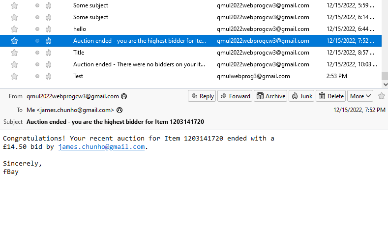

# Coursework 3 - Web Programming

## Note: My Gmail account may be locked



Shortly after we created the account, the Gmail account was locked by Google.

We have since created a new account, but Google may also lock it after the coursework is submitted.

## Restricted email sending addresses

I have limited the mailer to only send emails to Gmail addresses - **users that sign up using a non-gmail address will not receive an email.**

The reason for this is to avoid sending emails to "fake" email addresses used in the app such as `a@a.com` and `admin@admin.com`.

This is configured in `settings.py` as follows:

```python
# Addresses to send emails while PRINT_EMAILS is active
PRINT_PERMITTED_EMAILS_REGEX = [
    r"^.+@gmail\.com$",
]
```

## Required information

The site is hosted at: [https://django-psql-persistent-web-apps-ec20563.apps.d.comp-teach.qmul.ac.uk/](https://django-psql-persistent-web-apps-ec20563.apps.d.comp-teach.qmul.ac.uk/)

Information:

- Group 45

Login info:

Email|Password
---|---
`admin@admin.com`|`admin`
`a@a.com`|`a`
`b@b.com`|`b`
`c@c.com`|`c`
`d@d.com`|`d`
`e@e.com`|`e`

Contribution:

- Chun Ho Wong (`James Walker`)
  - OpenShift deployment, Project configuration, Models definition, User authentication, The rest of the API and refactoring, Typescript API module, Integrated `vue-router`, UI refactoring and styling, Gmail integration, Cronjobs
- Jinze Liu (`jinze2001`)
  - Profile update API, Item search API, Item bidding API, ListItems UI, ShowProfile UI, ChangeProfile UI, ChangeItem UI, ChangeQuery UI, AnswerQuestion UI
- Fahadur Rahman (`Fahi`)
  - Item update API, CreateItem UI, Item bidding API, UI bug fixes, Backend bug fixes
- Kei Nagai (`knagai323`)
  - JSON serialising, Item query API, ShowItem UI, Display queries on ShowItem, Bid form on ShowItem, UI bug fixes, Backend bug fixes

## Setting up the `.env` file

This project uses `.env` to set environment variables. Please create a `.env` file with the following information:

```python
GMAIL_API_CLIENT_ID = (Your Gmail API Client ID)
GMAIL_API_CLIENT_SECRET = (Your Gmail API Client Secret)
GMAIL_API_REFRESH_TOKEN = (A refresh token, generated by the )
DEFAULT_FROM_EMAIL = (The email address this is sent from)
MOCK_EMAILS = 'True'
```

To generate the refresh token, do this:

```powershell
gmail_oauth2 --generate_oauth2_token `
   --client_id=YOUR_CLIENT_ID `
   --client_secret=YOUR_CLIENT_SECRET `
   --scope="https://www.googleapis.com/auth/gmail.send"
```

## Development workflow

All work should be based in the `dev` branch, because any commits in `master` will immediately cause the OpenShift server to update.

You can work using 2 servers as usual: one for django and one for vite.

```bash
# Start the django server
python manage.py runserver

# Start the vite server
npm --prefix ./vite-project/ run dev
```

## Setting up the project from scratch

Overall, the steps are:

1. Create and use a virtual environment (`conda` or `venv`)
2. Install requirements
3. Run migrations to create the database
4. Create a superuser

Steps 1-3:

```bash
# Create a virtual environment using conda
conda create -n webprog-cw3 python=3.9
# Activate the environment
conda activate webprog-cw3

# Install requirements
# (If you encounter an error during installation, follow instructions in the next section)
pip install -r requirements.txt

# Run migrations
python manage.py migrate

# Create a superuser
python manage.py createsuperuser
```

### I get an error while installing requirements!

`psycopg2-binary` is buggy and tends to cause issues when you try to install from the `requirements.txt`. Install it manually instead:

```bash
pip install psycopg2-binary
```

Then go into `requirements.txt` and comment out the line containing "psycopg2-binary":

```r
Django>=4.1
gunicorn==20.0.4
Pillow==9.3.0
# psycopg2-binary==2.8.5
pytz==2020.1
sqlparse==0.3.1
whitenoise==5.1.0
```

Now try installing requirements again:

```bash
pip install -r requirements.txt
```
